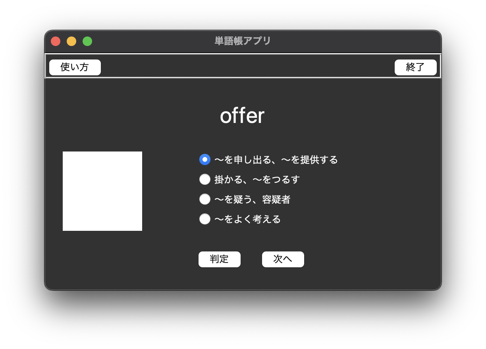
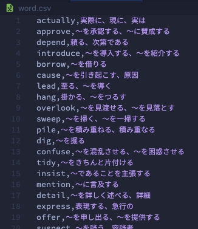
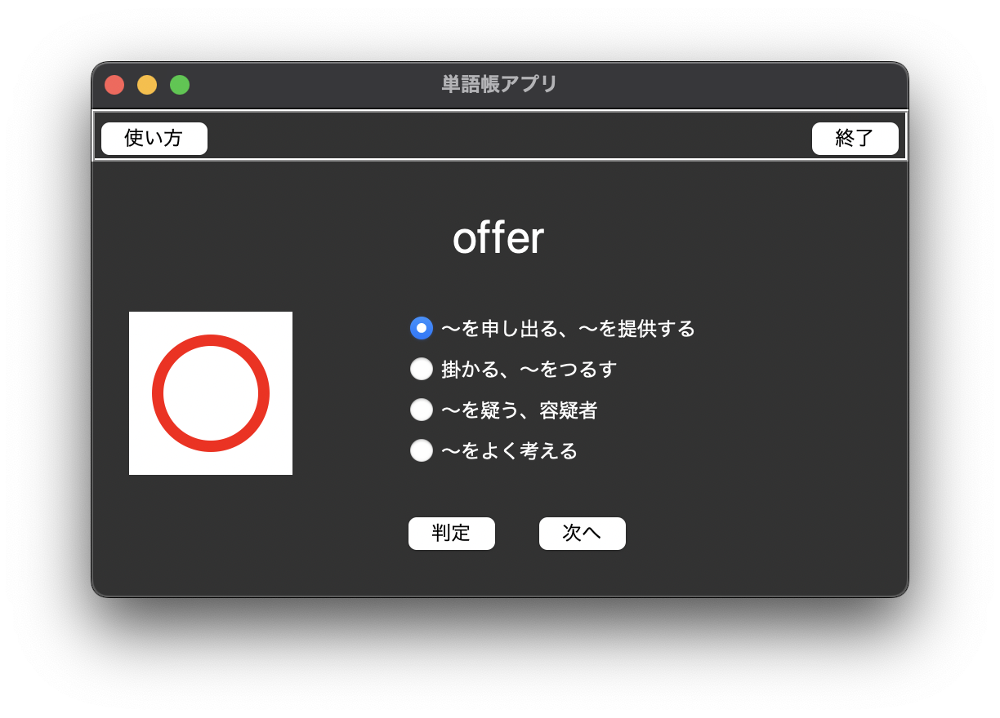
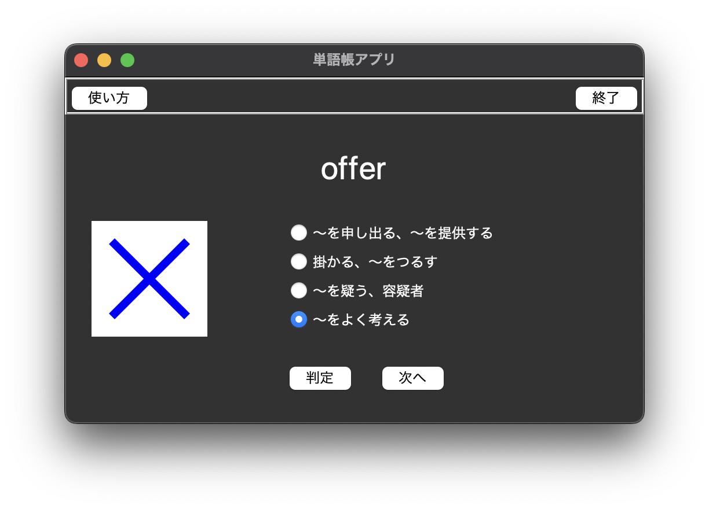
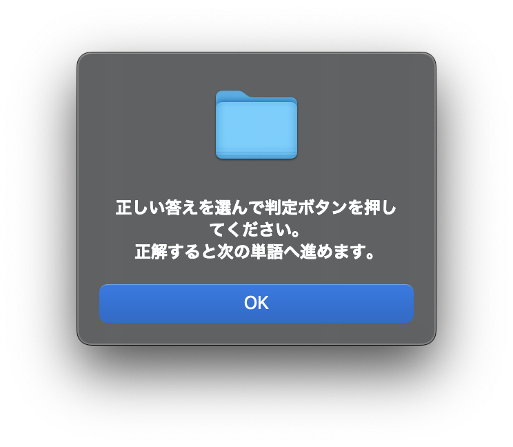

# WordBook

 

## 概要
PythonのTkinterで作った単語帳アプリ。  
csvファイルを読み込んで単語と選択肢をランダムに表示する。

 

## 使い方
main.pyと同じディレクトリに、単語と答えのセットが入ったword.csvを置いて実行。

 

 

単語がランダムに表示され、正しい答えを選んで判定ボタンを押すと次の問題に進むことができる。  
左上の使い方ボタンを押すと簡単な説明が表示される。

 

